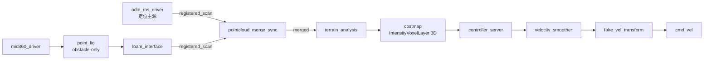

# GXU_ROBOTZ_NAV2026

GXU RobotZ 2026 赛季 ROS 2 (Humble) 导航工作空间 —— RoboMaster 哨兵机器人。

- Nav2 实车导航与建图（odin1 分支，无仿真）
- 双 LiDAR 3D 点云融合（odin1 + mid360）
- Docker 容器开发

导航主代码在 `src/gxu2026_sentry_nav/`。

---

## 环境

- Ubuntu 22.04 + ROS 2 Humble
- Docker + docker compose
- colcon, rosdep

---

## 目录

```text
src/          ROS 2 包（导航主代码在 gxu2026_sentry_nav/）
scripts/      启动/构建/诊断脚本
docker/       compose 文件（注意：里面的 Dockerfile 用不了，镜像走 DockerHub pull）
maps/         地图（容器生成，宿主机可见）
bags/         录包数据
```

---

## 快速开始

1. 环境镜像：直接从 DockerHub pull（已经帮你 pull 好了）。仓库里的 Dockerfile 用不了，不要去 build。

2. 启动开发容器：用 VS Code 的 **Container Tools** 插件，右键 `docker/compose.dev.yml` → **Compose Up**，选 profile（已经配好）：
   - `laptop` — 笔记本（有 GPU）
   - `robot` — 小电脑实车（无 GPU）

   容器只提供环境，代码和构建产物都是从宿主机挂载进去的（没有用 devcontainer）。

3. 容器内构建：

```bash
./scripts/quick_build.sh
```

---

## 运行

```bash
./scripts/nav.sh        # 导航（重定位模式，custom_map_mode=2）
./scripts/mapping.sh    # 建图（custom_map_mode=1）

./scripts/bag_nav.sh            # 导航 bag 回放
./scripts/bag_odin1_mapping.sh  # 建图 bag 回放
```

停止：正常情况在启动终端 **Ctrl+C** 即可。只有终端已经关掉、进程还在时才用 `./scripts/stop_launch.sh` 收尾。

odin 驱动模式由 `custom_map_mode` 决定（建图=1，重定位导航=2）。脚本会自动覆盖这个参数，所以用 `mapping.sh` / `nav.sh` 时不用手动设。

---

## 架构要点

数据流：双 LiDAR → 点云融合 → 地形分析 → costmap → Nav2 → cmd_vel。



实车关键约定：

- **定位主源是 odin1**，`odom -> base_footprint` 由 odin 驱动负责。
- **mid360 只补盲、不接管定位**，`point_lio` 跑 obstacle-only。
- 双 LiDAR 在 `pointcloud_merge_sync` 里合并（ApproximateTime 80ms）；mid360 不可用时自动回退到 odin1 单源。
- Costmap 用 `IntensityVoxelLayer`（3D 体素层），intensity = 地面相对高度。

navigation_launch 里有两个补盲开关，**默认都是关的**（`navigation_launch.py` 里设为 `false`）：

- `enable_mid360_costmap_additive` — mid360 → costmap 补盲
- `enable_scan_additive` — scan 合成链路

框架图：`docs/architecture/planned_pipeline.drawio`。

---

## 建图与重定位

**建图**：跑 `./scripts/mapping.sh`，odin 会以建图模式启动。终止程序时自动保存两份地图（都以时间戳命名）：

- pgm → 宿主机 `maps/`
- odin 的 bin → 宿主机构建产物 `.buildcache/odin1/src/odin_ros_driver/map/`
  - 每次建图一个以时间戳命名的文件夹，里面的 bin 文件名是 odin 开始建图的时间戳

**重定位**：先从建图产物里挑要用的图，手动搬到启动位置：

- bin：从 `.buildcache/odin1/src/odin_ros_driver/map/` 挑一份，放到 `src/odin_ros_driver/map/` 下
- pgm：从 `maps/` 挑一份，放到启动包的 map 目录 `src/gxu2026_sentry_nav/gxu2026_nav_bringup/map/` 下

然后把 bin 的**容器内绝对路径**（`/ws/src/odin_ros_driver/map/...`）填到 `src/odin_ros_driver/config/control_command.yaml` 的 `relocalization_map_abs_path`。然后直接跑 `./scripts/nav.sh` 即可（脚本会自动设 `custom_map_mode=2` 进入重定位模式）。

---

## NeuPAN 控制器

- 选用控制器：`src/gxu2026_sentry_nav/gxu2026_nav_bringup/config/reality/nav2_params.yaml`
- NeuPAN 调参：`src/gxu2026_sentry_nav/gxu2026_nav_bringup/config/reality/neupan_planner.yaml`

NeuPAN 用的是 Python 3.12，所以单独开了一个容器（已经开好）。

---

## Docker 说明

容器只提供环境，代码和构建产物都是从宿主机挂载进去的（`src/`、`scripts/`、`maps/`、`bags/` 等），改代码直接生效。

改业务代码后在容器内重新跑 `./scripts/quick_build.sh` 即可。
